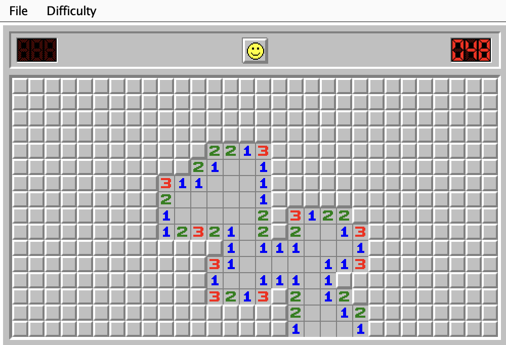

# Minesweeper
Minesweeper clone written in Java using Swing.  


## Play
It must be built and compiled from source. You can either play using the terminal or with the GUI.
```
# Clone the repo, or you skip this step and download this from github
git clone https://github.com/amadeus8182/Minesweeper.git
cd Minesweeper

# To play using the terminal
javac Minesweeper.java
java Minesweeper

# To play with the Graphical User Interface
javac MinesweeperGUI.java
java MinesweeperGUI
```
## TODO:
Priority:  
[X] - Flagging mechanic.  
[X] - Middle Clicking.  
[ ] - Custom difficulty.

Extras:  
[ ] - Sound effects.

Known Issues:  
[ ] - Bomb generation will not work properly if there are too many bombs.  


